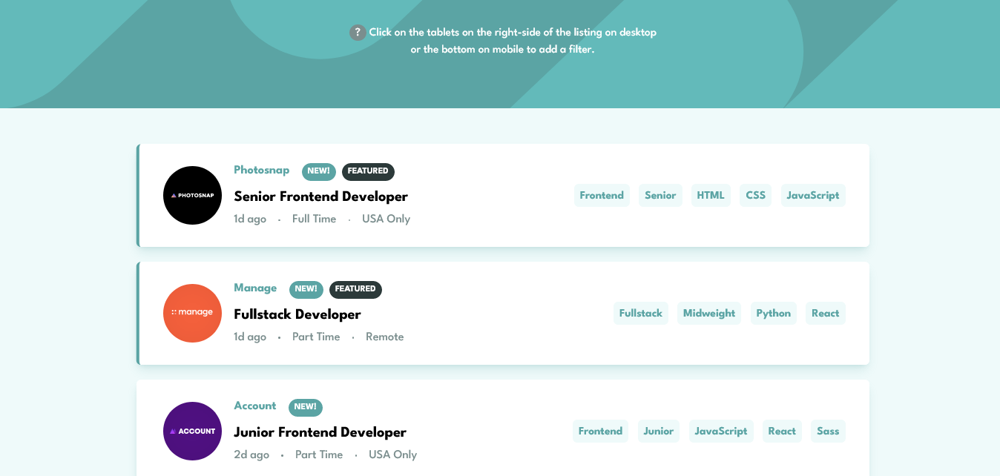

# Frontend Mentor - Job listings with filtering solution

This is a solution to the [Job listings with filtering challenge on Frontend Mentor](https://www.frontendmentor.io/challenges/job-listings-with-filtering-ivstIPCt). Frontend Mentor challenges help you improve your coding skills by building realistic projects.

## Table of contents

-   [Overview](#overview)
    -   [The challenge](#the-challenge)
    -   [Screenshot](#screenshot)
    -   [Links](#links)
-   [My process](#my-process)
    -   [Built with](#built-with)
    -   [What I learned](#what-i-learned)
    -   [Continued development](#continued-development)
    -   [Useful resources](#useful-resources)
-   [Author](#author)

## Overview

### The challenge

Users should be able to:

-   View the optimal layout for the site depending on their device's screen size
-   See hover states for all interactive elements on the page
-   Filter job listings based on the categories

### Screenshot



### Links

-   Solution URL: [on Frontend Mentor](https://github.com/dinadess/job-listings-fm/)
-   Live Site URL: [Job Listings](https://dinadess.github.io/job-listings-fm/)

## My process

### Built with

-   Semantic HTML5 markup
-   Accessibility
-   Flexbox
-   CSS Grid
-   Mobile-first workflow
-   [Vue JS](https://vuejs.org/) - JS framework (Pinia, Composition API)
-   [Tailwind CSS](https://tailwindcss.com/) - For styles

### What I learned

First :
I hit a roadblock when I wanted to create the filter logic. I first used the includes method, but it returned every listing containing at least one of the filter terms. But what I was looking for were items containing either all or none of the filter term. The idea was to check whether an array was a subset of another. The result was a combination of the every and includes methods.

Second :
I wanted to display different sets of data coming from different sources like arrays and strings. I used the spread operator in a v-for loop and it worked.

I wasn't sure whether this was going to function or not but I tried it and it worked perfectly (though I do not know if it's a good pratice or not).

Third:
A media query I didn't know it existed.

```css
@media (hover: hover) {
    a:hover {
        background-color: hsla(160, 100%, 37%, 0.5);
    }
}
```

### Continued development

-   CSS Grid -- I used it in this project but there's still a lot about it for me to learn.

### Useful resources

-   [Auto Animate](https://auto-animate.formkit.com/) - I wanted to use this library in my todo app project but it was not possible due to some conflicts. I had the opportunity to use it in this project to animate the display of the filtered listings.
-   [CSS Grid](https://css-tricks.com/snippets/css/complete-guide-grid/) This is a thorough article on css-tricks about CSS Grid.
-   [JS every](https://developer.mozilla.org/en-US/docs/Web/JavaScript/Reference/Global_Objects/Array/every) An article on MDN about the every method that helped me find out if an array is a subset of another one.

## Author

-   Frontend Mentor - [@dinadess](https://www.frontendmentor.io/profile/dinadess)
